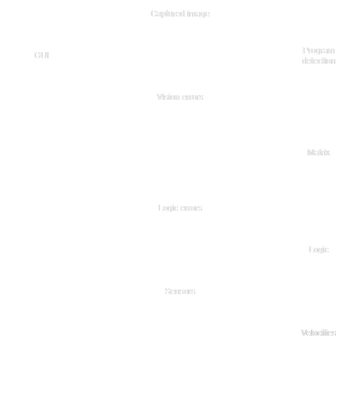

# SERP2

This repository contains the implementations made for SERP robot in Engineering Systems course. This project consists on the replication and improvement of the "Standalone Educational Robot with behaviour defined by Paper 1" (SERP1), developed in a previous iteration of this course. SERP is a robot that moves according to a set of instructions described on a paper sheet. Therefore, the robot is able to:

 - View the sheet of paper;
 - Identify the instructions present on it (described by ArUco markers);
 - Transform these instructions into programmable logic;
 - Execute the desired algorithm.

Folder organization:
 - **SERP1** - Implementation made by the first team in the 2021/2022 course edition. [(Original repo)](https://github.com/jorgef1299/SERP).
 - **SERP2** - Implementation made by the team of the 2022/2023 course edition.

 ## SERP2
 To run the program the `serp` and `rosserial` packages must be in the ROS workspace folder (In the given robots the workspace is  the `catkin_ws` folder, the packages must be directly inside `catkin_ws\src`).

In the `Arduino` folder, the `.ino` file is used to control the motors. The files for the needed dependencies are in `Arduino/libraries`.

The `setup.py` is a python script that allows to connect the raspberry to a new wi-fi via a bluetooth socket (using [Serial Bluetooth Terminal App](https://play.google.com/store/apps/details?id=de.kai_morich.serial_bluetooth_terminal&hl=pt_PT&gl=US)).

The `serp` package was implemented by us and has the following structure:

### Nodes
 - **GUI** - main node, controls the graphical interface (developed with gtk).
 - **Program detection** - converts the captured image in two matrices that represente the connections between blocks in graph form.
 - **Logic** - traduces the graph into velocities for each motor.
 - **Object detection** -  Converts the image aquired from the fisheye camera into distances to objects in 4 directions (front, left, right and rear).
 - **Arduino** - Implements the motor controllers, so that the robot achieves the desired velocities.
 
### Hardware
 - Raspberry Pi (RPi) 4 Model B
 - Arduino Uno
 - Uninterrupted Power Supply (UPS)
 - SD Card
 - 200º Camera for RPi
 - USB Camera (140º)
 - DC Motors with Encoder
 - Adafruit TB6612
 - Heatsink for RPi

